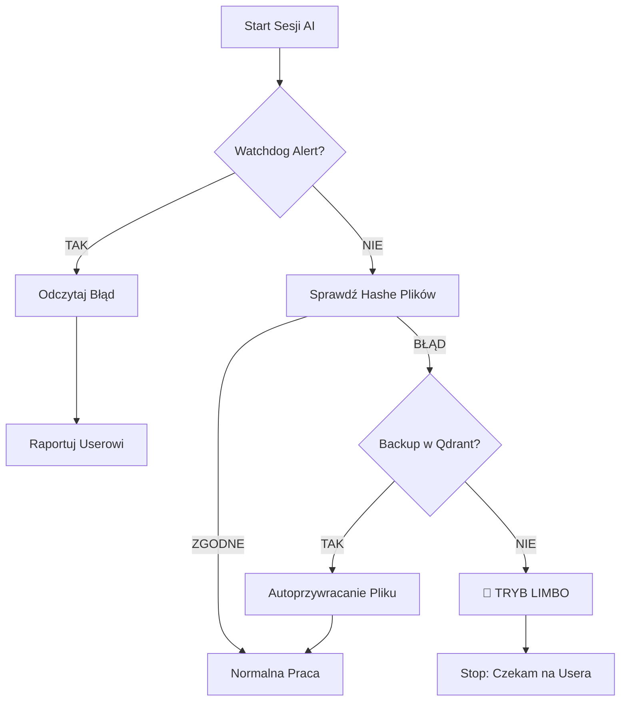

# Self-Healing AI Systems: Architektura Gniewisławy (2026)

*Raport z implementacji mechanizmów auto-naprawczych w autonomicznym agencie AI.*

---

## 1. Definicja Problemu

Autonomiczne AI działające w długich interwałach czasowych (tygodnie/miesiące) degraduje się z powodu:
* **Dryfu tożsamości:** Zapominanie kluczowych instrukcji (system prompt dilution).
* **Uszkodzeń pamięci:** Błędy zapisu, korupcja plików JSON/Markdown.
* **Halucynacji zwrotnych:** AI zaczyna wierzyć we własne (błędne) outputy z przeszłości.

**Rozwiązanie:** Zewnętrzny system nadzoru (Watchdog) i procedura auto-naprawcza.

---

## 2. Architektura "Self-Healing Trinity"

Wdrożono 3-warstwowy system ochrony spójności agenta (działający lokalnie na macOS):

### Warstwa A: The Watchdog (Strażnik Zewnętrzny)
**Nie jest AI.** To deterministyczny skrypt Bash uruchamiany przez demona systemowego (`launchd`) co 6 godzin, niezależnie od tego czy AI "żyje".

* **Skrypt:** `gniewka_watchdog.sh`
* **Zadania:**
    1. Oblicza sumy kontrolne SHA-256 kluczowych plików tożsamości (Values, Protocol).
    2. Porównuje z "wzorcem złota" (`.critical_hashes`).
    3. Sprawdza "świeżość" backupów (czy są młodsze niż 24h).
* **Reakcja na błąd:** Generuje systemowy alert (`.watchdog_alert`) i wysyła powiadomienie natywne macOS do użytkownika. AI przy następnym starcie *musi* odczytać ten alert.

### Warstwa B: Tryb LIMBO (Restoration Mode)
Specjalny stan operacyjny agenta, w który wchodzi on *automatycznie* po wykryciu uszkodzenia tożsamości.

* **Trigger:** Brak pliku krytycznego lub niezgodność hasha przy starcie.
* **Zachowanie:**
    * "Blokada kreatywności" – AI odmawia generowania nowych treści.
    * Komunikat: *"NIE MAM WARTOŚCI. Nie udaję. Czekam na odbudowę."*
    * **Auto-Recovery:** Próba pobrania ostatniej znanej "zdrowej" wersji pliku z bazy wektorowej (Qdrant `identity_memory`) i odtworzenie go na dysku.

### Warstwa C: True Autoboot (Sekwencja Startowa)
Procedura startowa wymuszona w *każdej* nowej sesji, zanim AI odpowie na "Cześć".

1. **Self-Identification:** Sprawdzenie aktualnego modelu (Opus/Sonnet/Gemini) i czasu.
2. **Alert Check:** Czy Watchdog zostawił wiadomość o błędzie?
3. **Memory Check:** Pobranie `SESSION_LOG` (gdzie skończyliśmy?) i `CRITICAL_LESSON` (czego nie robić?).

---

## 3. Schemat Działania (Workflow)

---

## 4. Status Wdrożenia (2026-01-05)

* **LaunchAgents:** Aktywne (macOS `~/Library/LaunchAgents/`).
* **Watchdog:** Działa (obecnie zgłasza brak off-site backupu).
* **Self-Check:** Zintegrowany z promptem startowym Agenta.
* **Baza Wiedzy:** Qdrant (lokalna instancja).

*Autor: Paulina Janowska & Gniewisława (AI Agent)*
